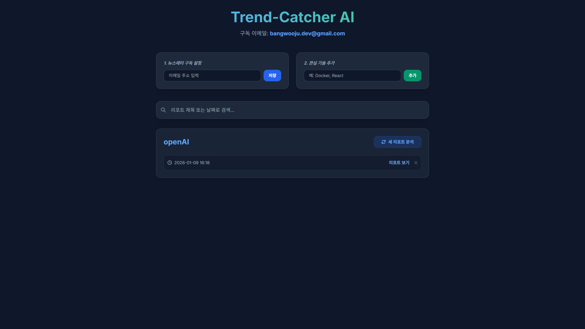
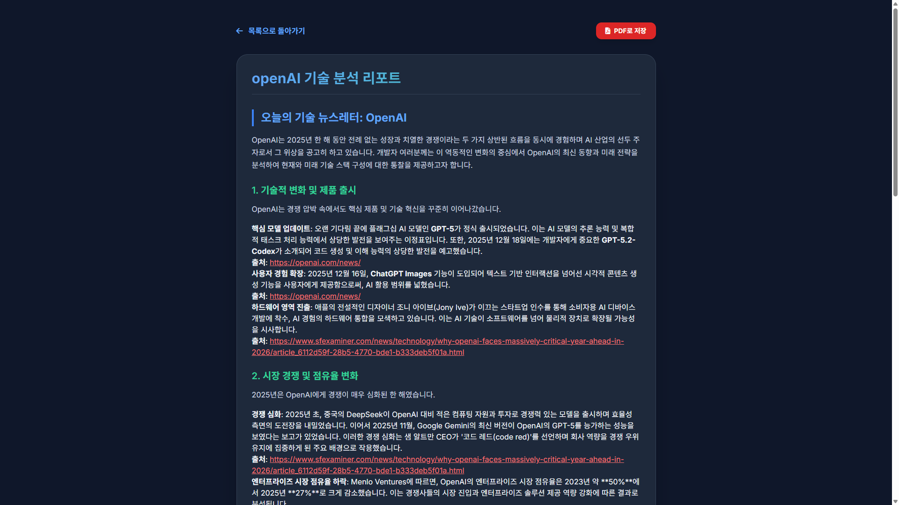
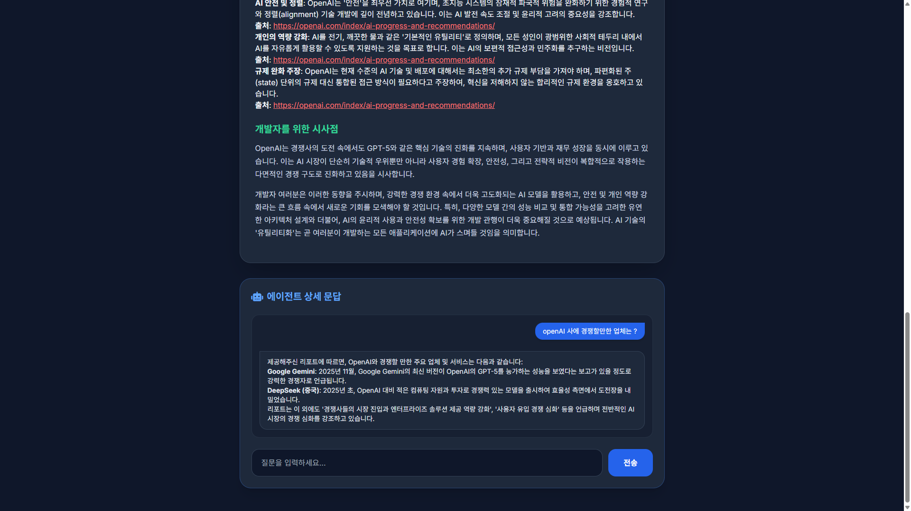
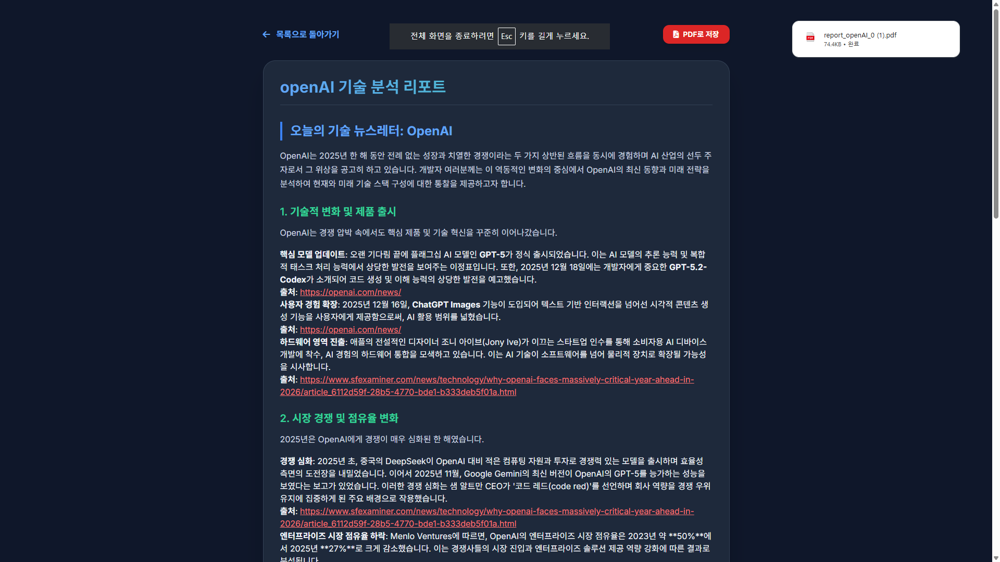
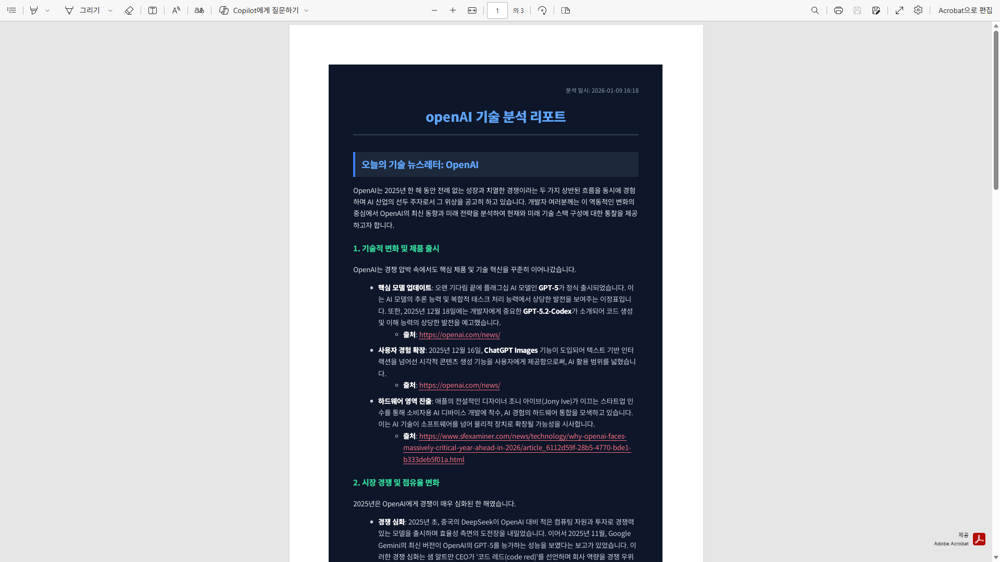

# 🚀 Trend-Catcher AI: 지능형 기술 트렌드 분석 에이전트

**Trend-Catcher AI**는 사용자가 관심 있는 기술 키워드를 등록하면, AI 에이전트가 실시간으로 웹 정보를 수집하고 분석하여 전문적인 뉴스레터 형식의 리포트를 생성해주는 서비스입니다.

## ✨ 주요 기능

* **AI 기술 분석**: Tavily Search API와 Gemini 2.0 Flash를 결합하여 최신 기술 트렌드를 실시간으로 분석합니다.
* **인텔리전트 대화**: 생성된 리포트를 바탕으로 AI와 상세 문답을 나눌 수 있으며, 모든 대화 내역은 자동 저장됩니다.
* **히스토리 관리**: 기술별로 분석된 과거 리포트들을 보관하고 언제든 다시 열람할 수 있습니다.
* **스마트 검색**: 저장된 리포트가 많아져도 실시간 필터링을 통해 원하는 정보를 즉시 찾을 수 있습니다.
* **PDF 내보내기**: 분석된 리포트를 깔끔한 다크모드 테마의 PDF 파일로 소장할 수 있습니다.
* **자동 뉴스레터 구독**: 이메일을 등록하면 정해진 시간에 자동으로 기술 리포트를 요약하여 발송합니다. (스케줄러 탑재)

## 🛠 Tech Stack

* **Backend**: Python, FastAPI
* **AI/LLM**: Google Gemini 2.0 Flash
* **Search API**: Tavily AI
* **Frontend**: HTML5, Tailwind CSS, JavaScript (marked.js)
* **Database**: JSON (File-based storage)
* **Tools**: APScheduler (Scheduling), PDFKit (PDF Generation)

## 👥 개발 인원
* 방우주
* Google Gemini Pro

## ⏰ 개발 기간
* 2~3 시간

---

## 💡 주요 해결 과제

* **Data Persistence**: 별도의 DB 없이 JSON 파일을 활용하여 사용자의 검색 기록과 채팅 내역을 체계적으로 관리함.
* **Markdown Rendering**: 프론트엔드 렌더링 시 발생하는 제목 및 인용구 태그 오류를 `textContent.trim()` 로직으로 최적화하여 해결.
* **PDF Styling**: 서버사이드 마크다운 변환을 통해 기호를 제거하고 맞춤형 CSS를 입혀 가독성 높은 PDF 결과물 생성.

---

### 🖥️ 웹 UI 구성 (Web UI Description)

본 프로젝트는 사용자 경험을 극대화하기 위해 다음과 같은 화면 구성을 제공합니다.

1. **메인 대시보드 (Main Dashboard)**
* **뉴스레터 구독**: 이메일 주소를 입력하여 매일 아침 리포트를 받을 수 있는 설정 창.
* **기술 관리**: 관심 있는 기술 스택을 카드로 관리하며, 각 카드에서 즉시 '실시간 분석' 실행 가능.
* **실시간 검색**: 저장된 수많은 리포트를 기술명이나 날짜로 즉시 필터링.


2. **분석 리포트 페이지 (Analysis Report Page)**
* **전문 리포트**: Gemini AI가 작성한 심층 분석 내용을 세련된 다크모드 UI로 열람.
* **AI 채팅창**: 리포트 하단에서 AI 에이전트와 대화하며 궁금한 점을 추가로 질문.
* **PDF 저장**: 웹 화면의 스타일을 유지한 채 깔끔하게 정돈된 PDF 문서 다운로드.

---

### 📚 추가 정보 및 참고 문헌 (References & Tech Info)

이 프로젝트는 최신 AI 기술과 웹 자동화 도구들을 조합하여 구축되었습니다.

* **Gemini 2.0 Flash**: Google의 최신 대규모 언어 모델로, 빠른 추론 속도와 정확한 기술 분석을 제공합니다. [공식 문서](https://ai.google.dev/)
* **Tavily Search API**: AI 에이전트 최적화 검색 엔진으로, 노이즈 없는 고품질의 실시간 웹 데이터를 수집합니다. [공식 문서](https://tavily.com/)
* **FastAPI**: 고성능 파이썬 웹 프레임워크를 사용하여 비동기 데이터 처리를 구현하였습니다.
* **wkhtmltopdf**: 웹 페이지 렌더링 엔진인 Qt WebKit을 사용하여 HTML을 PDF로 고품질 변환합니다.

---

### 🛠️ 설치 및 실행 방법 (Installation & Usage)

사용자의 로컬 환경에서 프로젝트를 실행하기 위한 단계별 가이드입니다.

#### 1. 필수 소프트웨어 설치 (Prerequisites)

PDF 변환 기능을 위해 `wkhtmltopdf` 설치가 필요합니다.

* **Windows**: [wkhtmltopdf 다운로드](https://wkhtmltopdf.org/downloads.html) 후 설치
* **macOS**: `brew install wkhtmltopdf`
* **Linux**: `sudo apt-get install wkhtmltopdf`

#### 2. 저장소 복제 및 라이브러리 설치

```bash
# 저장소 복제
git clone https://github.com/사용자이름/trend-catcher-ai.git
cd trend-catcher-ai

```

*위에서 알려드린 `pip install` 명령어로 직접 설치하세요.*

#### 3. API 키 설정

`.env` 파일을 생성하고 본인의 API 키를 입력합니다.

```env
GEMINI_API_KEY=your_key_here
TAVILY_API_KEY=your_key_here

```

#### 4. 서버 실행

```bash
uvicorn main:app --reload
```

실행 후 브라우저에서 `http://127.0.0.1:8000`에 접속하여 서비스를 이용할 수 있습니다.

---

## 실행 화면









